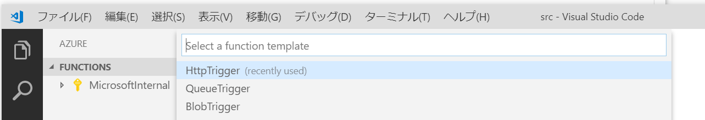
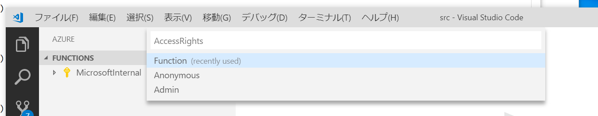
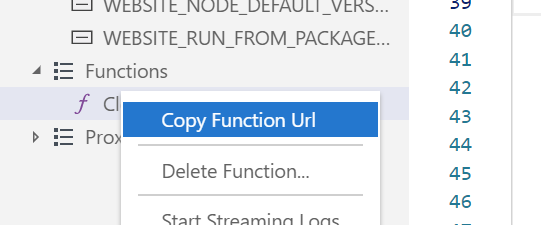

# 環境

## インストールするもの

- Windows
    - Visual Studio Code https://code.visualstudio.com/
    - .NET Core 2.1 https://www.microsoft.com/net/download/windows
    - Node.js 8.5 以降 (https://docs.npmjs.com/downloading-and-installing-node-js-and-npm)
    - Azure Functions Core Tools
    - ngrok (ローカルで Clova のテストをするため) https://ngrok.com/

Azure Functions Core Tools は Node.js までインストールした後に以下のコマンドでインストール出来ます。

```
npm install -g azure-functions-core-tools
```

- macOS
    - Visual Studio Code https://code.visualstudio.com/
    - .NET Core 2.1 https://www.microsoft.com/net/download/macos
    - Homebrew https://brew.sh/
    - Azure Functions Core Tools
    - ngrok (ローカルで Clova のテストをするため) https://ngrok.com/

Azure Functions Core Tools は Homebrew までインストールした後に以下のコマンドでインストール出来ます。

```
brew tap azure/functions
brew install azure-functions-core-tools
```

### Visual Studio Code の設定

以下の拡張機能をインストール

- C#
- Azure Functions

# コードの作成

作業用のフォルダーを Visual Studio Code で開いて画面左にある Azure のアイコンを選択。


Functions の Create New Project... を選択


今開いてるフォルダを選択


言語で C# を選択


プロジェクトが出来たので関数を作成。Create Function を選択


プロジェクトのフォルダーを選択


HttpTrigger を選択



関数名を入力


関数の名前空間を入力


認証方法を入力（匿名だとインターネット上にさらされることになるので、アクセスキーによる認証の Function でいいと思う）



Clova.cs が作成されます。


Clova の Extension を作るための CEK.CSharp というライブラリ(https://github.com/kenakamu/clova-cek-sdk-csharp)を入れます。
C# のライブラリは NuGet (https://nuget.org) でホストされていて dotnet add package コマンドで入れます。

Visual Studio Code のターミナルで以下のコマンドを入力します。

```
dotnet add package CEK.CSharp
```

Ctrl + Shift + B でビルドします。エラーが出ないことを確認（要確認 macOS でのショートカット）

Clova.cs の中の Run メソッドを書いていきます。名前空間の追加や各種補間を使って書くといい感じ。

例：まだ using namespace していない（JavaScript でいうところの import) クラスを使う時。
- クラス名をうつ
- Ctrl + . を入力
- using namespace を追加する選択肢が出るので選択
- using namespace が追加される


とりあえず何が来ても「こんにちは」を返す関数。

```cs
using System;
using System.IO;
using System.Threading.Tasks;
using Microsoft.AspNetCore.Mvc;
using Microsoft.Azure.WebJobs;
using Microsoft.Azure.WebJobs.Extensions.Http;
using Microsoft.AspNetCore.Http;
using Microsoft.Extensions.Logging;
using Newtonsoft.Json;
using CEK.CSharp;
using CEK.CSharp.Models;

namespace MangaClova
{
    public static class Clova
    {
        [FunctionName("Clova")]
        public static async Task<IActionResult> Run(
            [HttpTrigger(AuthorizationLevel.Function, "get", "post", Route = null)] HttpRequest req,
            ILogger log)
        {
            // リクエストのボディの JSON を検証して C# のクラスに変換。
            var clovaClient = new ClovaClient();
            var clovaRequest = await clovaClient.GetRequest(req.Headers["SignatureCEK"], req.Body);

            // 返事を作成
            var clovaResponse = new CEKResponse();
            clovaResponse.AddText("こんにちは。");

            // レスポンスとして作成した返事の内容を返す
            return new OkObjectResult(clovaResponse);
        }
    }
}
```

F5 で実行。ngrok を使ってインターネットからアクセスできるようにする。VSCode のターミナルで新しいターミナルを開いて以下のコマンドを実行。

```
ngrok http 7071
```


Clova Extension Kit のスキルの Webhook の URL を入れる所に ngrok で表示された URL + /api/Clova を入れます。

例：https://dc67c9a1.ngrok.io/api/Clova

Clova の対話モデルのテストで話しかけると、何を話しても「こんにちは。」を返します。

おみくじ機能を追加します。

```cs
using System;
using System.IO;
using System.Threading.Tasks;
using Microsoft.AspNetCore.Mvc;
using Microsoft.Azure.WebJobs;
using Microsoft.Azure.WebJobs.Extensions.Http;
using Microsoft.AspNetCore.Http;
using Microsoft.Extensions.Logging;
using Newtonsoft.Json;
using CEK.CSharp;
using CEK.CSharp.Models;

namespace MangaClova
{
    public static class Clova
    {
        [FunctionName("Clova")]
        public static async Task<IActionResult> Run(
            [HttpTrigger(AuthorizationLevel.Function, "get", "post", Route = null)] HttpRequest req,
            ILogger log)
        {
            // リクエストのボディの JSON を検証して C# のクラスに変換。
            var clovaClient = new ClovaClient();
            var clovaRequest = await clovaClient.GetRequest(req.Headers["SignatureCEK"], req.Body);

            // 返事を作成
            var clovaResponse = new CEKResponse();

            switch (clovaRequest.Request.Type)
            {
                case RequestType.LaunchRequest:
                    // 起動時の処理
                    clovaResponse.AddText("こんにちは。占ってって言うと占います。");
                    clovaResponse.ShouldEndSession = false; // スキルを終わらせないように設定する
                    break;
                case RequestType.SessionEndedRequest:
                    // 終了時の処理。今回は無し。case 自体不要だけど説明用に今回は追加してる
                    break;
                case RequestType.IntentRequest:
                    // インテントの処理
                    switch (clovaRequest.Request.Intent.Name)
                    {
                        case "FortuneTellingIntent":
                            // 占いのインテント
                            var result = new[]{ "大吉", "中吉", "小吉", "末吉" }[new Random().Next(4)];
                            clovaResponse.AddText($"占いの結果は {result} です。");
                            break;
                        default:
                            // 認識できなかったインテント
                            clovaResponse.AddText("こめんなさい。よくわかりませんでした。占ってって言うと占います。");
                            clovaResponse.ShouldEndSession = false; // スキルを終わらせないように設定する
                            break;
                    }
                    break;
            }

            // レスポンスとして作成した返事の内容を返す
            return new OkObjectResult(clovaResponse);
        }
    }
}
```

これで話しかけると毎回違った結果が返ってくるようになります。

## Azure にデプロイ

Deploy to Azure Function を選択


認証などをしてないとログインとかが求められるはず…。

Create New Function App を選択

Function App の名前を入れます。URL に使われるので世界で一意である必要があります。


リソースグループを作成します。Create new resource group を選択。
リソースグループは Azure 上の作成するアプリや DB をひとまとめにして管理するフォルダのようなものです。


リソースグループ名を入れます。


Azure Functions が内部で使うストレージを作ります。Create new storage account を選択。


ストレージアカウント名を入れます。（これも世界で一意である必要があります）


リージョンを選択します。日本は Japan West と Japan East があります。

リージョンを選択するとデプロイが始まります。


出力ウィンドウで Azure Functions を選択するとデプロイの状況が確認できます。


デプロイが完了すると Visual Studio Code から関数が確認できます。


Clova を右クリックすると関数の URL をコピーできます。



この URL を Clova Extension Kit の Skill の Webhook の URL に入れると Azure Functions で動くようになります。
